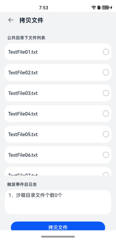
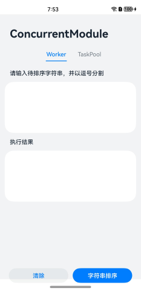
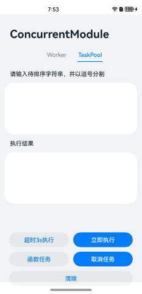

# 多线程任务

### 介绍

本示例通过@ohos.taskpool和@ohos.worker接口，展示了如何启动worker线程和taskpool线程。

### 效果预览

| 首页                                | 拷贝文件                                 | 字符串排序                            | 任务池页面                           |
|-----------------------------------|--------------------------------------|----------------------------------| ------------------------------------ |
|  |  |  |  |

使用说明

1. 在主界面，可以点击**字符串排序**和**拷贝文件**按钮进入对应的界面；

2. 点击**字符串排序**按钮进入多线程界面：

   worker：

    1. 选择**Worker**页签，输入待排序的字符串，并以逗号分割。

    2. 点击**字符串排序**按钮，会将排序前的字符串发送给worker线程，在worker线程实现字符串排序，然后将排序后的字符串发送给主线程，主线程中显示排序后的字符串。

    3. 点击**清除**按钮，清除字符串。

   taskpool：

    1. 选择**TaskPool**页签，输入待排序的字符串，并以逗号分割。

    2. 点击**立即执行**按钮，任务执行完成后将排序后的字符串显示出来。

    3. 点击**超时3s执行**按钮，任务延迟3s后执行，执行完成后将排序后的字符串显示出来。

    4. 点击**函数任务**按钮，直接调用执行操作，执行完成后将排序后的字符串显示出来。需要注意的是，通过**函数任务**创建的task任务不支持取消。

    5. 点击**取消任务**按钮，会取消最后一个未执行的task任务。需要注意的是，只有当任务数大于最大线程数且任务未开始执行时才可以取消成功。

    6. 点击**清除**按钮，清除字符串。

3. 点击**拷贝文件**按钮进入文件拷贝界面：

   选择需要拷贝的文件，然后点击**拷贝文件**按钮，文件拷贝成功，触发事件日志显示沙箱下文件个数以及显示部分拷贝成功的文件名。

### 工程目录

```
├──entry/src/main/ets                         // 代码区
│  ├──common
│  │  ├──Common.ets                           // 公共工具类
│  │  └──Logger.ets                           // 日志工具类
│  ├──component
│  │  ├──TaskPoolTab.ets                      // taskpool页签
│  │  └──WorkerTab.ets                        // worker页签
│  ├──entryability
│  │  └──EntryAbility.ets  
│  ├──model
│  │  ├──MyWorker.ets                         // 批量拷贝文件方法类
│  │  ├──TaskPoolTab.ts                       // taskpool页签
│  │  └──WorkerTab.ts                         // worker页签
│  └──pages
│     ├──CopyFile.ets                         // 拷贝文件页面
│     ├──TaskPoolTab.ets                      // taskpool页签
│     └──WorkerTab.ets                        // worker页签
└──entry/src/main/resources                   // 应用资源目录
```

### 具体实现

* worker页签的实现在字符串排序页面调用，源码参考[StrSort.ets](entry/src/main/ets/pages/StrSort.ets)
    * 字符串排序：通过调用executeWorkerFunc()创建一个worker线程，把待排序字符串发送给worker线程，等worker线程排序完成后再把结果返回。
    * 清除：把字符串输入框和结果都清除。

* taskpool页签的实现在字符串排序页面调用，源码参考[StrSort.ets](entry/src/main/ets/pages/StrSort.ets)
    * 立即执行：通过调用executeImmediately()创建一个task任务，这个任务是立即执行字符串排序。
    * 超时3s执行：通过调用executeDelay()创建一个task任务，这个任务是延迟3s后执行字符串排序。
    * 函数任务：调用executeFunc()接口，不创建task任务，直接调用taskpool.execute()执行字符串排序。
    * 取消任务：调用cancelTask()接口，取消最后一个未执行的task任务。
    * 清除：把字符串输入框和结果都清除。

* 批量拷贝文件的功能封装在MyWorker，源码参考：[MyWorker.ets](entry/src/main/ets/model/MyWorker.ets)

    * 拷贝文件：在[CopyFile.ets](entry/src/main/ets/pages/CopyFile.ets)中调用MyWorker.WorkToCopyFiles()，在WorkToCopyFiles方法中向worker03线程发消息，并在worker03线程中批量拷贝，拷贝完成后将结果返回。

### 相关权限

不涉及。

### 依赖

不涉及。

### 约束与限制

1.本示例仅支持标准系统上运行，支持设备：华为手机。

2.HarmonyOS系统：HarmonyOS NEXT Developer Preview1及以上。

3.DevEco Studio版本：DevEco Studio NEXT Developer Preview1及以上。

4.HarmonyOS SDK版本：HarmonyOS NEXT Developer Preview1 SDK及以上。